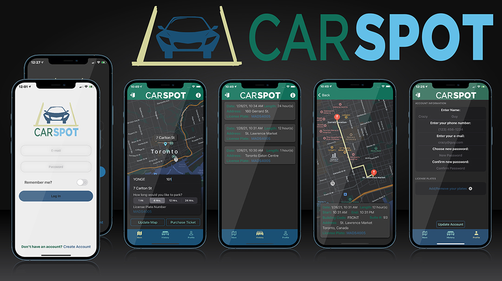

# CarSpot - iOS Parking App

### Authors
[Brian Domingo](https://github.com/BrianJayD) ,  [Daryl Dyck](https://github.com/daryldyck/)
___

___
## About The Project
### Login Page
##### By Brian Domingo

**Features include:**
- Build in UIKit
___
### Profile Page
##### By Brian Domingo

**Features include:**
- Build in SwiftUI
___
### Purchase Ticket Page
**_By Daryl Dyck_**

**Features include:**
- Build in SwiftUI
- Map (SwiftUI 2.0) with current location annotation
- Forward Geocoding (Fetching location from street address)
- All user data retrieved from CoreData
___
### Ticket History Page
##### By Daryl Dyck

**Features include:**
- Build in UIKit
- TableView with all previous parking tickets
- All ticket data retrieved from CoreData
___
### Ticket Details Page
##### By Daryl Dyck

**Features include:**
- Build in UIKit
- MKMapView with current location and route to location of parking ticket
- Reverse geolocation used to get parking location from latitude and longitude
